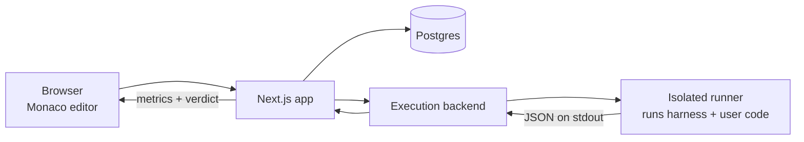

# ByteArena

An interactive coding platform and secure evaluation engine for **systems engineering**
challenges. Not another algorithm quiz site: you implement real storage and hardware
internals, and your solution is graded on the metrics engineers actually argue about.

The first challenge asks you to write the data-movement policy for a simulated NAND
flash device. Your code is scored on write amplification, erase count, and wear evenness
against a synthetic workload of thousands of operations, then attacked with injected
hardware faults to see whether the logic actually holds up.

The current open-source runtime executes submissions through a local Docker
backend. A synthetic stub is available for UI development. Durable judging,
production worker isolation, and official evaluation are under active
development and must not be represented as production-ready security boundaries.

---

## How it works



A submission is materialized into a purpose-built runner image containing the
challenge harness. User code is injected, the harness drives it through a
deterministic workload while recording metrics, one JSON object is written to
stdout, and the container is removed. The backend validates that result and stores
the current challenge result.

The execution layer sits behind a single interface with two implementations, so the whole
system runs locally without hosted execution credentials:

| `EXECUTION_MODE` | Backend | Used for |
|------------------|---------|----------|
| `local` | Local Docker daemon | Development and the entire test suite |
| `stub` or unset | Synthetic result | UI development only; never official |

There is no production Fly adapter in the current tree. The architecture audit
tracks the migration from in-process execution to a durable, isolated worker.

---

## Stack

| Concern | Choice |
|---------|--------|
| Framework | Next.js 16, React 19, TypeScript |
| Styling | Tailwind CSS v4 |
| Editor | Monaco |
| Database | PostgreSQL 16 via Prisma 7 |
| Auth | NextAuth v5, GitHub and Google OAuth |
| Current local isolation | Docker container |
| Planned production isolation | Dedicated judge worker with a reviewed sandbox |
| Simulator | Go |
| Tests | Vitest, Playwright, `go test` |

---

## Running it

Requires Docker, Node.js 22, and npm. Go is required only when running the
simulator tests directly on the host.

```bash
npm ci
cp .env.example .env.local
docker build -t bytearena-sprite:latest ./sprite
npm run docker:up
npm run db:push
npm run db:seed
```

The app is served at `http://localhost:3100`.

```bash
npm run docker:logs            # tail the web container
npm run docker:reset           # wipe volumes and rebuild from scratch
npm run docker:down            # stop everything
```

---

## Verification

The project is developed test-first, and "it looks fine" is not accepted as evidence.
Alongside conventional unit and end-to-end tests, every route is put through an automated
**layout audit** at five viewports before any phase is considered complete.

```bash
npm run test        # unit and component tests (Vitest)
npm run test:e2e    # end-to-end and layout audit (Playwright)
npm run test:audit  # layout audit only
npm run test:go     # simulator tests
npm run hygiene     # tracked-file and public/private-boundary checks
npm run verify      # typecheck, lint, unit, e2e
```

### The layout auditor

Six checks run inside the page against real computed geometry:

| Check | What it catches |
|-------|-----------------|
| Occlusion | Text or controls covered by an unrelated element |
| Horizontal overflow | Content wider than the viewport, and the element responsible |
| Text clipping | Text cut off with no ellipsis or line clamp |
| Contrast | Text below the WCAG AA ratio against its true composited background |
| Off-viewport | Visible elements positioned outside the viewport |
| Tap targets | Controls under 44x44 px on mobile |

Occlusion is detected by sampling points inside each element's box and asking
`document.elementFromPoint` what is actually painted there. Because the browser resolves
the real stacking order, this reports genuine visual defects rather than the harmless
bounding-box intersections that naive overlap checks drown in.

### X-ray mode

Every element is outlined in a colour that appears nowhere in the design, and the
screenshot is analysed at the pixel level for boundary crowding, with dense regions
tinted in an annotated copy. `outline` is used rather than `border` specifically because
outlines do not participate in layout, so enabling x-ray cannot itself shift the page and
manufacture the defects being looked for.

This is a heuristic second opinion: it catches things geometry is blind to, such as CSS
transforms and clipped scroll containers, and produces an artefact that is quick to review
by eye. The geometric audit remains the gate that fails a build.

Artefacts land in `tests/e2e/__screenshots__/<route>/`:

```
laptop.png                  clean screenshot, full page
laptop.xray.png             every element boundary drawn
laptop.xray-hotspots.png    crowded regions tinted
laptop.report.json          machine-readable violations
```

Viewports certified: 320, 390, 768, 1280 and 1920 CSS pixels wide.

---

## Layout

```
prisma/          schema, migrations, seed data
src/
  app/           routes, layouts, route handlers
  components/    UI
  lib/           db, auth, execution backends, scoring
sprite/          Go simulator, challenge harnesses, sandbox image
tests/
  unit/          Vitest
  e2e/           Playwright specs and the layout auditor
docs/
  product.md     product brief
  ASSUMPTIONS.md every decision made without sign-off, and why
```

---

## Documentation

- [`docs/product.md`](docs/product.md) — what this is and who it is for
- [`docs/ASSUMPTIONS.md`](docs/ASSUMPTIONS.md) — decisions taken without explicit
  sign-off, each with its rationale and the cost of reversing it
- [`docs/architecture-audit.md`](docs/architecture-audit.md) — implemented
  architecture and migration gaps
- [`docs/releases.md`](docs/releases.md) — release and compatibility policy
- [`docs/dependency-policy.md`](docs/dependency-policy.md) — dependency,
  advisory, and license review requirements
- [`CONTRIBUTING.md`](CONTRIBUTING.md) — contribution and verification rules
- [`SECURITY.md`](SECURITY.md) — private vulnerability reporting and current
  security limitations

## License

ByteArena is licensed under the [Apache License 2.0](LICENSE). See
[NOTICE](NOTICE) for attribution information.
